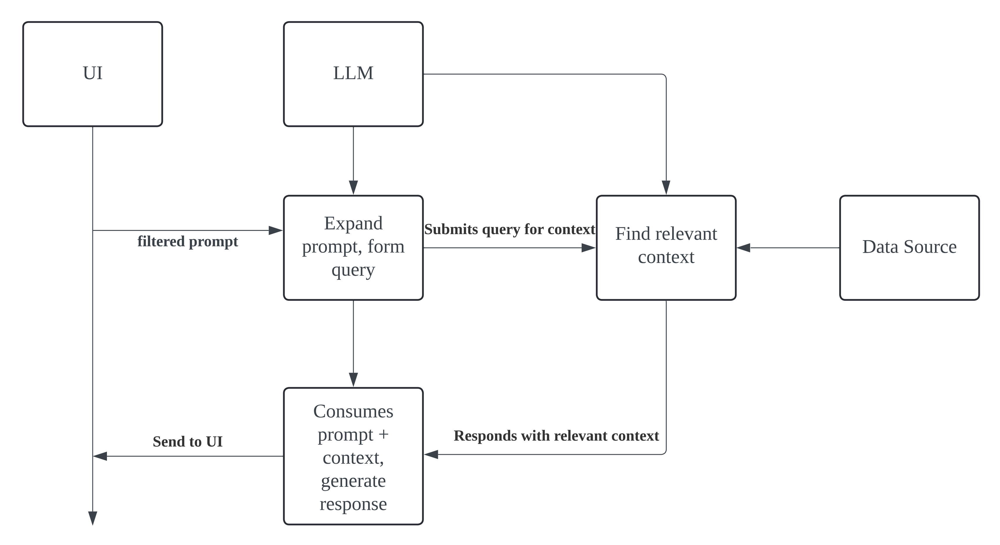

# CVCoach

This repository is a project for METCS673. This project focuses on using AI to automate and improve the process of resume evaluation and interview preparation. By incorporating Retrieval-Augmented Generation (RAG), we ensure that our application can provide more accurate, context-relevant reviews.

An artifical intelligence tool powered by the ???. It can provide several services for job seekers, interviewers and HRs, such as refining the CV, mocking interviews and writing questions based on resumes.

## Data Collection and preprocessing
### 1. Data Collection
The data we used for this projects are obtained from Kaggle:
- livecareer: https://www.kaggle.com/datasets/snehaanbhawal/resume-dataset
- IT departments: https://www.kaggle.com/datasets/gauravduttakiit/resume-dataset

Our dataset, comprising over 3,300 resumes, was collected from Kaggle. The livecareer dataset provide string as well as PDF formated data with ID, Resume_str, Resume_html and Category. PDF stored in the data folder differentiated into their respective labels as folders with each resume residing inside the folder in pdf form with filename as the id defined in the csv. The IT departments dataset, available in CSV format, contains category and resume.

### 2. Preprocessing

In the preprocessing, two distinct datasets were merged into a unified structure to facilitate efficient data analysis and model training. At the end of this process, a CSV file is created with the following columns (`category`, and `resume_string`). The data in it has the following format

| category                                 | resume_string   |
|------------------------------------------|-----------------|
| A category label describing the job role | The resume text |

## System Architecture

Below is an overview of our system workflow, including how we use the combination of AI and RAG to enhance the process of resume analysis and specific system features.

### 1. Workflow Diagram

#### Description of the Workflow

User Interface (UI): Users interact with the system through the UI, where they can upload prompts and then ask for resume evaluation and interview preparation.

LLM (Large Language Model): Users' prompt is filtered and delivered to the LLM. Then the LLM will expand the initial prompt into a more detailed query.

Data Source: This component represents external databases where our preprocessed resume dataset is stored.

Find Relevant Context: The system searches resumes stored in our database to find relevant context that enhances the understanding of the input query.

Send to UI: The final response, which includes corresponding resume evaluation, modification suggestions, interview simulation, etc. according to the user's needs, is sent back to the user interface for the user's review.

### 2. Backend Diagram

#### Basic Functionality

- Resume evaluation
- Suggestions for improvement
- Interview question generation
- Project recommendations

## Inference and Result
### 1. Evaluation

### 2. Result

## Task Management

As per github's task tracking flow is difficult to use, we decide to use Notion's KanBan to trace the progress and manage the risk.

[✅ notion workflow board](https://www.notion.so/56748261d0fd4b1ba5869a99602822df?v=15a842aff8ae4422bf08245de0da4f68)

## How to contribute this project?

> Tips: Make sure there is no repeated issues or PRs before opening a new one.

[🎤 Commit an issue](https://github.com/BUMETCS673/seprojects-cs673a2f24_team5/issues/new/choose)  

[⌨️ Raise a PR](https://github.com/BUMETCS673/seprojects-cs673a2f24_team5/pulls)  

[📖 Development manual](./doc/development_manual.md)  

## What's the CI/CD processes of this project?

[📔 CI/CD Intro](./doc/CICD.md)
[notion workflow board](https://www.notion.so/56748261d0fd4b1ba5869a99602822df?v=15a842aff8ae4422bf08245de0da4f68)

